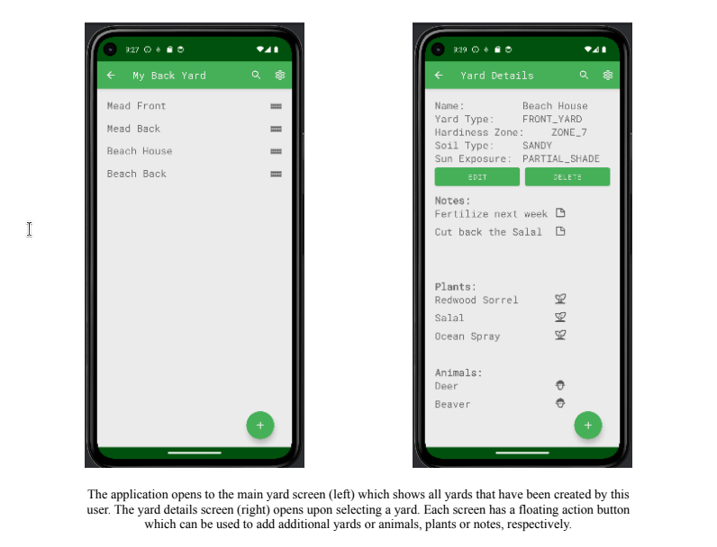
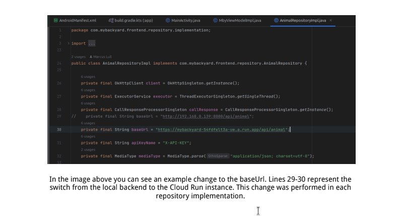

# My BackYard Mobile Application
## ** The backend service for this project is currently offline **
A frontend client mobil app for My BackYard
* Java (17)
* Android SDK
  * compileSdk 34  
  * minSdk 27  
  * targetSdk 34
* JUnit (5.0)
* OKHTTP (4.12.0)
* GSON (2.10.1)

## Description
My BackYard is a full stack application designed to act as a handy reference for
homeowners, gardeners or even landscapers as they tend to their yards or gardens. Inspired by
my wife, who loves spending time tending to all of our various plants, there came a point where
she required some sort of note system to help her remember all the facts and notes about our
home's ecosystem.  
  
I have designed My BackYard as a full stack application divided into a backend and
frontend components that utilizes a REST API for communication between the two components.
At this stage in the application development functionality is limited and represents only a
minimum viable product however I have placed much of my focus on a backend architecture that
will allow for growth both in scope and demand.  

## Frontend

The frontend component for this project is an Android application. At this stage in
development it amounts to a list of lists that pretty much follows the relationship model of the
backend. Since the data model was designed following the real life pattern the frontend app
becomes just a visual representation of that.  
  
The Android application has a single activity that acts as a common space for a fragment container that is home for the UI fragments and central view model data cache which acts to keep API calls to a minimum. In addition to the fragments dedicated to displaying the model objects I also have an admin fragment which allows for input of an API key and a search fragment from which the user can search for yards, plants, and animals by name. 
  
## Screenshots

## Updating the API Key

Upon the first run of the Android app the application will open the Admin screen as there
is no API key present. An API key is required to make requests of the server. The app will not
function properly without a good API key. Also, at any time you may click on the gear icon to
open the Admin screen.  

## Examples

For this demo of My BackYard I included two demo API keys as environment variables. One key is an
admin API key and the other is for a regular user.  

#### Demo Keys
* admin 9f9635ea_f25b_424d_87ed_1ddf8baf8ecf_1703010016526mby
* user b55a17a7_ff28_44af_b500_b13844bb41d8_1702921958962mby

To switch API keys simply paste a key into the field
and tap save. Upon tapping save you will be redirected
to the Yards screen where you are now free to
add/remove/edit yards as needed.  

The two demo API keys are meant to show that the app
is aware of the principal user and will only display info
that is rightfully owned by that user. You can test this
functionality by entering the first API key and creating a Yard, then swap to the other API key.
You will see that the yard created by the first API key is no longer available. Swap keys back to
the first one and you can now see that the Yard is visible again.  

### Adding a Yard

In this demo there are only 2 API keys for use as detailed above. Because of this there
may already be some example yards created. Please feel free to add more or edit/delete existing
yards as you see fit. The created objects in this demo are not real data and will be wiped after the
internal test period.  
  
If there are no yards present as shown in this image
tap the Floating Action Button plus symbol in the lower
right corner of the display. This will open up the add a
yard dialog.  
  
Once on the Add Yard screen you can name your
first yard and choose options that fit your yard from the
various spinners. Once you have made your selections tap
the save button to save your yard and return to the
previous screen where you should now see your yard
listed.  
  
To see the details of your yard or add Plants, Animals, or notes, tap your yards listing to navigate 
to the yard details screen. Searching for Yards, Animals, or Plants by Name
You can search for created yards, animals or plants by name. With the current UI layout
searching may become a more efficient way to find the object you are looking for. To search for
an object by name you can click on the magnifying glass of the app bar any time.  
  
Clicking the magnifying glass will open the search
screen shown here to the left. The search field acts in
real time as you are typing to retrieve all yards, plants,
or animals that are relative to the input. At this time it is
limited to object names only. Images and Notes must be
located manually.  

### Edit or Delete an Object

You may need to change the name of an object or
remove it all together. To do this tap the object in
question to navigate to its details screen. Once on the
details screen you can click either the Edit or Delete
button as needed.  
  
Editing an object will take you to the edit screen
giving you an opportunity to change any details about the
object and save. Deleting an object will permanently
remove that object from the database along with any
attached objects such as notes, plants, animals, etc... You
will get a confirmation dialog after tapping Delete.

## Usage
1. Clone the repository
2. Run the application in Android studio using a virtual device

## Build and Deploy
### Update the base url

  
  
In addition to the baseURL change, the application also had to be
packaged for deployment. Android Studio, the development environment I am using
for this application makes this process easy however. From the Build menu in Android
Studio I first ran the Clean Project command. This removes any prior build or testing
remnants and gives you a good clean starting point to work from. Next, again from the
build menu, I ran Generate Signed Bundle. This packages the app in the preferred
bundle and makes it ready for deployment. Generating a signed bundle requires the
author to create a keystore. The process for doing so is a matter of filling out a series
of prompts that the wizard presents. Some required information included:

* A keystore path - this is the local directory where the keystore will reside
* Keystore password
* Key alias and password
* Validity period
* Certificate information requiring the following
* First and Last name
* Organizational unit
* Organization
* City
* State
* Country
  
After setting the Keystore information you have the option for creating a
production or debugging build which in this case I chose production. The build process
takes just a few seconds and the application is now ready for deployment.
